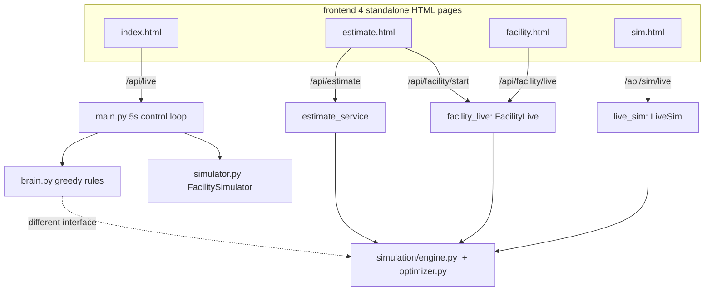
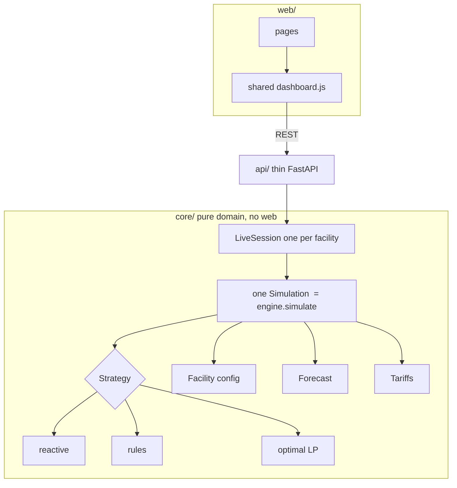

# Design Audit

A working document. It maps how myEnergy is built **today**, names the structural
problems honestly, proposes a **target** architecture, and lists the refactors in
priority order. We edit this together and use it to drive the cleanup, one
tests-guarded step at a time.

> The point of this audit: turn "it feels messy" into "here are 4 concrete problems
> and the order to fix them." The core algorithms are sound and tested (152 checks,
> `engine.py` at 100%). The debt is in how the pieces are **assembled**, not in the
> logic itself. And because the suite exists, we can restructure safely.

---

## 1. How it's built today

The app grew as **three separate flows** that were bolted onto one codebase, so they
overlap and duplicate each other.

Module inventory (non-test):

| Module | Lines | Role | Belongs to |
|--------|------|------|-----------|
| `backend/main.py` | 376 | FastAPI app, endpoints, the 5s demo control loop | demo + all |
| `backend/live_sim.py` | 285 | `LiveSim` accelerated savings session | `/sim` |
| `backend/brain.py` | 280 | greedy **rule** decision engine | demo only |
| `backend/facility_live.py` | 214 | `FacilityLive` per-user session | `/facility` |
| `backend/pricing_service.py` | 170 | geocoding + tariff table | per-user |
| `backend/simulator.py` | 159 | `FacilitySimulator` fake hardware | demo only |
| `backend/models.py` | 158 | dataclasses (readings, decision, device) | mixed |
| `backend/weather.py` | 150 | Open-Meteo forecast | all |
| `backend/estimate_service.py` | 126 | facade: city to savings | `/estimate` |
| `backend/database.py` | 110 | SQLite history | demo |
| `backend/savings.py` | 59 | month-to-date savings | demo |
| `simulation/factory.py` | 222 | `FacilityConfig`, tariffs, weather, prices | core |
| `simulation/engine.py` | 217 | **validated physics** (`simulate`, `_apply_battery`) | core |
| `simulation/optimizer.py` | 133 | LP-MPC **optimal** controller | core |
| `simulation/controllers.py` | 92 | `reactive`, `predictive` controllers | core |

---

## 2. The problems (with evidence)

**P1. Three overlapping products, two ways to do the same thing.**
The `/` demo and the `/facility` page both render "a live facility dashboard," but
through completely different code: `main.py` control loop + `brain.py` + `simulator.py`
for the demo, versus `facility_live.py` + the engine for the per-user view. Same goal,
duplicated pipeline.

**P2. Two decision engines with different interfaces.**
`brain.decide(BrainInput) -> EnergyDecision` (greedy rules, with the load-shifting /
demand-cap / arbitrage logic) lives entirely separately from
`optimizer.optimal(StepState) -> float` and `controllers.reactive/predictive`. Two
"brains," two data shapes, and only one of them (the rules) has the newest features
while only the other (the optimiser) is provably optimal.

**P3. Four things simulate a facility.**
`FacilitySimulator` (simulator.py), `FacilityLive` (facility_live.py), `LiveSim`
(live_sim.py), and `engine.simulate()` each model solar/battery/load. The physics is
copied and slowly diverging (which is how bugs like the frozen battery and the
solar-fraction-over-100% crept in).

**P4. Leaky package boundaries.**
`backend/` reaches into `simulation/` through **6 `sys.path.insert` hacks**
(estimate_service, facility_live, live_sim, savings, simulator, weather). Neither
folder is a real Python package, so imports are fragile and the dependency direction
is unclear.

**P5. Frontend duplication.**
The 4 HTML pages each re-implement their own `fetch`/poll/render loop instead of
sharing one dashboard component.

---

## 3. Target architecture

One core domain, a thin API over it, and a web layer that reuses one dashboard. The
"demo" becomes just a **preset facility** running the same live session as a user's.

Key moves:
- **One decision interface** (`Strategy: state -> action`). The optimiser is the
  default brain; the rule engine becomes one selectable strategy behind the same
  interface. No more "two brains."
- **One simulation** (the validated `engine`), wrapped by a single `LiveSession` that
  both the demo and the per-user flow use. Delete the other three simulators.
- **A real package** (`myenergy/core`, `myenergy/api`, `web/`) so imports are clean
  and dependencies point one way: `web -> api -> core`. No `sys.path` hacks.
- **One shared frontend dashboard** the pages reuse.

---

## 4. Refactor backlog (priority order)

Each step is guarded by the existing tests: refactor, run `pytest`, confirm behavior
is unchanged. Ordered low-risk-first so we build momentum before the big one.

| # | Refactor | Fixes | Risk | Notes |
|---|----------|-------|------|-------|
| **R1** | Turn `backend/` + `simulation/` into a proper package; delete the 6 `sys.path` hacks | P4 | **Low** | Pure move + import rewrite. Tests catch any break. Good warm-up. |
| **R2** | Collapse the 4 simulators into one `LiveSession` over `engine.simulate`; make the demo a preset facility | P1, P3 | **Medium** | Biggest duplication removed. The per-user pipeline becomes the only pipeline. |
| **R3** | One `Strategy` interface; fold `brain.py`'s rules in as a strategy beside `reactive`/`optimal` | P2 | **High** | Behavior-sensitive; also the product endgame (loads into the optimiser). Do last. |
| **R4** | Extract a shared `dashboard.js` the pages import | P5 | **Low** | Independent of the others; can slot in anytime. |

---

## 5. Principles we're refactoring toward

- **One way to do each thing.** One simulation, one decision interface, one dashboard.
- **Dependencies point one direction:** `web -> api -> core`. The core never imports the web.
- **The core is pure** (no FastAPI, no HTTP) so it stays fast to test.
- **Never break green.** Every step keeps the 152 checks passing; if a refactor needs a
  behavior change, that is a deliberate, separately-logged decision, not an accident.

---

_Status: draft for review. Next: agree the target in section 3, then start R1._
